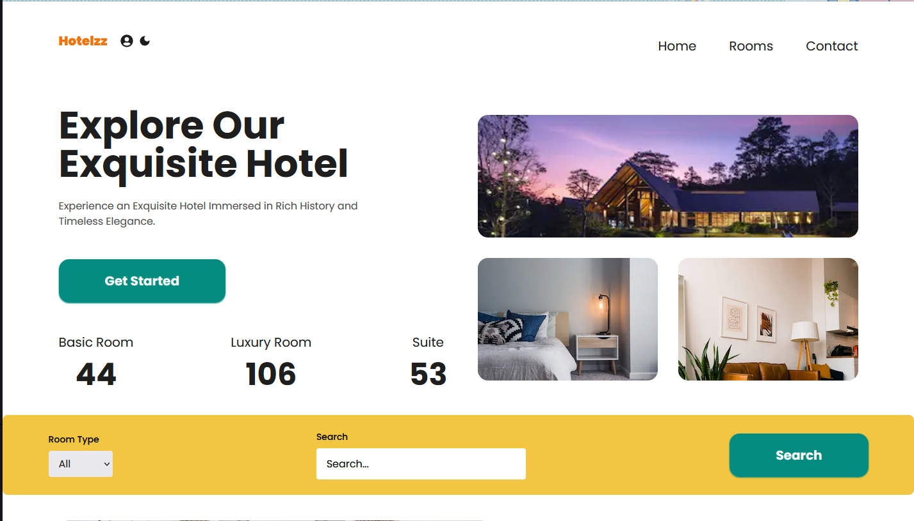
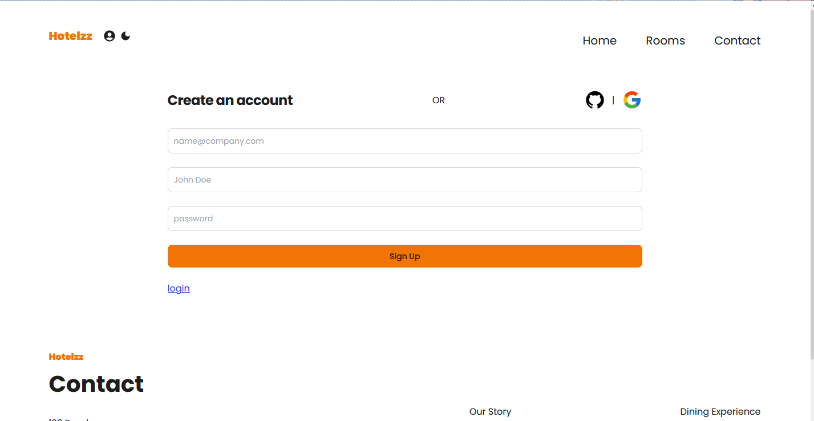
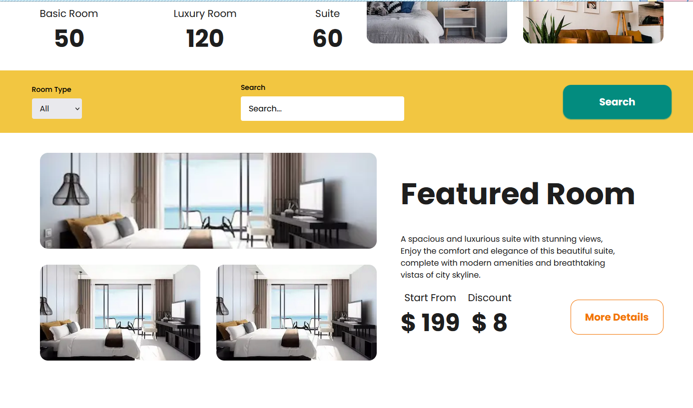
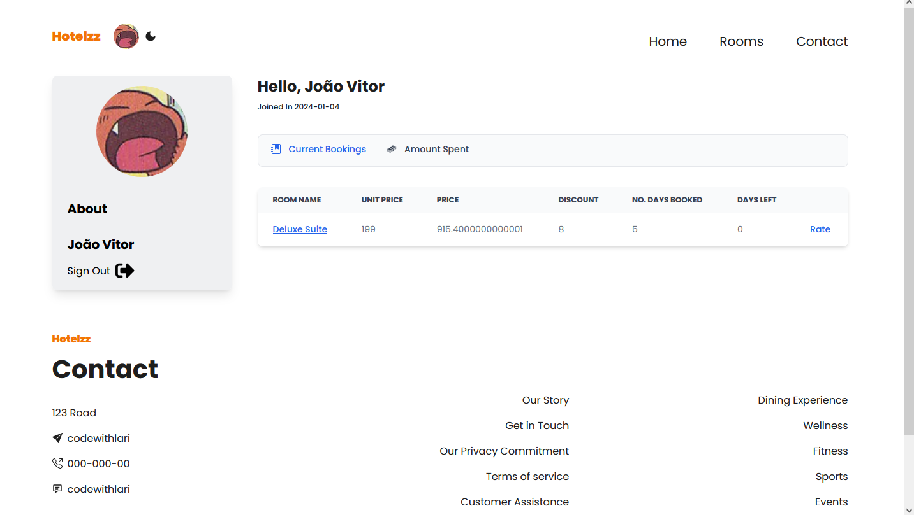

<h1 align="center">Hotelzz</h1>

    <a href="#sobre">Sobre</a> | <a href="#tecnologias">Tecnologias</a> | <a href="#run">Rodando o projeto</a>

## 🚀 Sobre

Aplicação Frontend que utiliza Sanity.IO como serviço de Headless CMS, Stripe para efetuar pagamentos e plataformas de autenticação como GitHub e GCP. Tudo isso
simulando um cenário de agendamento de hotels com sistema de avaliação.

## :computer: Tecnologias

### Web

### Infra

### Executando a aplicação

Configurando as variáveis de ambiente:

1. **NEXT_PUBLIC_SANITY_PROJECT_ID e NEXT_PUBLIC_SANITY_DATASET:**
   - **Acesso:** Essas informações são obtidas ao criar um projeto no [Sanity.io](https://www.sanity.io/).
   - **Criação:**
     - Visite [Sanity.io](https://www.sanity.io/) e faça login ou crie uma conta.
     - Crie um novo projeto e escolha um dataset.
     - Após criar o projeto, você encontrará o `Project ID` no painel de configurações do seu projeto.

2. **NEXT_PUBLIC_STRIPE_PUBLISHABLE_KEY:**
   - **Acesso:** Esta chave é fornecida pelo [Stripe](https://stripe.com/).
   - **Criação:**
     - Cadastre-se ou faça login no [Stripe](https://stripe.com/).
     - No dashboard, procure por "Developers" e então "API keys".
     - Aqui você encontrará a chave publicável (Publishable Key).

3. **NEXTAUTH_SECRET:**
   - **Criação:** Esta é uma chave secreta que você mesmo gera. Pode ser qualquer string segura e única. Uma maneira comum de gerar essa chave é usando uma ferramenta de linha de comando como o OpenSSL, executando um comando como `openssl rand -hex 32`.

4. **GITHUB_APP_ID e GITHUB_APP_SECRET:**
   - **Acesso:** Essas são obtidas ao registrar um novo OAuth App no GitHub.
   - **Criação:**
     - Visite [GitHub Developer Settings](https://github.com/settings/developers).
     - Clique em "New OAuth App".
     - Preencha os detalhes necessários e registre o aplicativo. Após o registro, você receberá o App ID e o Secret.

5. **GOOGLE_CLIENT_ID e GOOGLE_CLIENT_SECRET:**
   - **Acesso:** Estas são obtidas através do Google Developer Console.
   - **Criação:**
     - Acesse [Google Developer Console](https://console.developers.google.com/).
     - Crie um projeto.
     - Na seção "Credenciais", crie credenciais do tipo OAuth 2.0.
     - Após a criação, você receberá o Client ID e o Secret.

6. **SANITY_STUDIO_TOKEN:**
   - **Acesso:** Criado no painel do Sanity.
   - **Criação:**
     - No painel do Sanity, vá para a seção "API".
     - Crie um token com as permissões necessárias para o seu projeto.

7. **STRIPE_SECRET_KEY e STRIPE_WEBHOOK_SECRET:**
   - **Acesso:** Disponíveis no dashboard do Stripe.
   - **Criação:**
     - Para a `STRIPE_SECRET_KEY`, siga o mesmo processo da `NEXT_PUBLIC_STRIPE_PUBLISHABLE_KEY`, mas procure pela Secret Key.
     - Para o `STRIPE_WEBHOOK_SECRET`, você precisa configurar um webhook no Stripe. No dashboard do Stripe, vá para a seção "Webhooks" e crie um novo webhook. Após a criação, você receberá o webhook secret.

Depois que adicionar suas informações no .env.example, renomeie ele para .env

 

Quando você acessa `http://localhost:3000/studio` para trabalhar com o Sanity Studio em um projeto Next.js, é essencial configurar as políticas de CORS (Cross-Origin Resource Sharing) no Sanity para garantir que o seu estúdio possa se comunicar corretamente com o back-end do Sanity. Aqui estão as etapas para configurar o CORS e as credenciais no Sanity:

1. **Acessar o Painel de Controle do Sanity:**
   - Faça login na sua conta no [Sanity.io](https://www.sanity.io/).
   - Vá para o painel de controle do projeto que você está trabalhando.

2. **Configurar CORS no Sanity:**
   - No painel de controle do Sanity, procure a seção de configurações ou 'Settings'.
   - Encontre a opção de 'CORS Origins' ou algo similar. Esta opção permite que você defina quais origens são permitidas para acessar seu conteúdo.
   - Clique em "Add CORS Origin".
   - Insira o endereço que você está usando para o seu estúdio local, que normalmente é `http://localhost:3000` (ou a porta que você estiver utilizando).
   - Certifique-se de marcar a opção que permite credenciais, se necessário. Isso é importante se o seu estúdio estiver usando cookies ou autenticação baseada em sessão.
   - Salve as alterações.

3. **Verificar as Credenciais:**
   - Assegure-se de que as credenciais fornecidas no arquivo `.env` do seu projeto Next.js, como `SANITY_STUDIO_TOKEN`, estão corretas e correspondem às configuradas no painel do Sanity.
   - O token do Sanity Studio deve ter as permissões adequadas para acessar e manipular os dados conforme necessário.

4. **Testar o Acesso:**
   - Após configurar o CORS e verificar as credenciais, tente acessar `http://localhost:3000/studio` novamente.
   - Se tudo estiver configurado corretamente, você deve ser capaz de acessar o Sanity Studio e interagir com o back-end do Sanity sem problemas de CORS.

5. **Considerações de Segurança:**
   - Ao configurar o CORS, é importante limitar o acesso apenas às origens que realmente precisam de acesso ao seu back-end. Isso ajuda a prevenir ataques e exposições indesejadas.
   - Em um ambiente de produção, você deve atualizar as configurações de CORS para refletir o URL do seu ambiente de produção em vez de `localhost`.

Configurar o CORS e as credenciais corretamente é um passo fundamental para garantir que o seu ambiente de desenvolvimento Sanity Studio funcione de maneira segura e eficiente.

#### _Sinta-se livre para colaborar, toda ajuda é bem vinda ;)_

 
